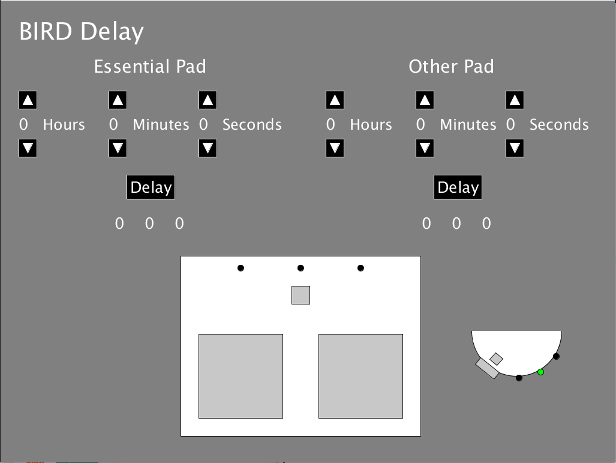
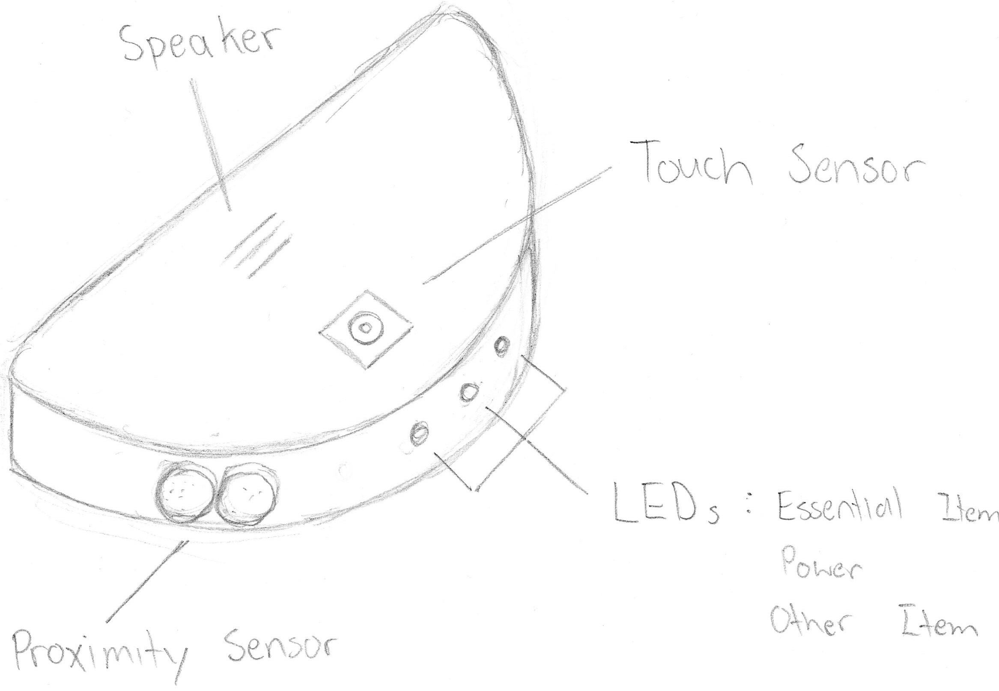
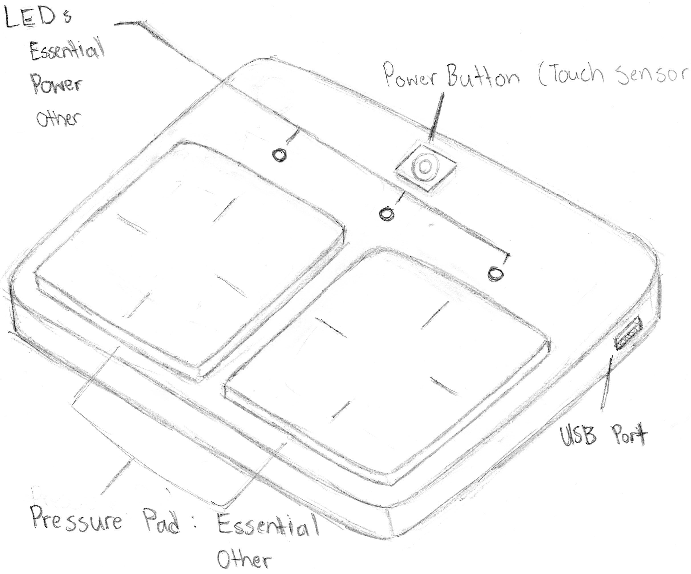

# BIRD

BIRD is a dual-Arduino and Processing reminder system.

Physical build:

Processing application:

## Acronym

BIRD stands for:

**B** atman  
**I** tem  
**R** eminder  
**D** evice

## Overview

The purpose of the system is to allow a user to place their items on a sensor in their house, and be reminded of the items (if they have been forgotten) when the user enters their car to leave.  
Either or both of the sensors can be delayed until a specified date and time - for example, if the user wants to be reminded of a textbook which they don't need to bring until next week.

Further details can be found in the report.

## Setup

See the READMEs in the *arduino/* and *processing/* folders.

## About

This project was a group project in *IAT 267: Introduction to Technological Systems* at Simon Fraser University for the Spring 2016 semester.
